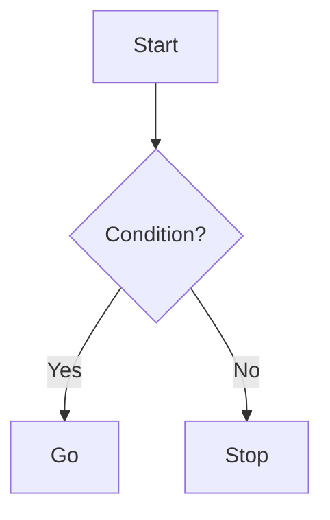

todos
=====

This is the list of things to do or decide:

1. **Configuration**

2. **File format**

3. **Operations**

   * *Compute khappa*
   * *recode*
   * *join*

```mermaid
graph TD
   A[Start] --> B{Condition?} 
   B -- Yes --> C[Go] 
   B -- No --> D[Stop] 
```
