User's guide
============

This is the user's guide

Installation
------------

The common requirements are `Python <https://www.python.org>`_ and 
`vlc <https://www.videolan.org/vlc/>`_

Then, *when avalaible on pypi*, the installation should reduce to:

.. code-block:: bash

   pip install codix

Initialisation (TODO)
---------------------

Before using the encoder or the analyser, codix configuration has to be
initialised using:

.. code-block:: bash

   codix init

asks the following questions:

- Choose codix working directory (default: USER/codix_projects or
  USER/codix_wd):

- Choose theme (default: XXX)

  The themes are provided by the ttk-themes url?

- Other configurations?

Encoder guide
-------------

Launch Codix
^^^^^^^^^^^^^^

• Open the Terminal.
• Type the following command:

.. code-block:: bash

   ./codix

• A small window opens: Check that the displayed directory matches the desired folder.
• Click **OK**.

Launch codix encoder using the icon? or the command

.. code-block:: bash

   codix-encoder

1. Is it a new project?

   - if "Yes":

      * Define the structure of the project (**TODO**)
      * Define the coding frame of the project (newcode)

   - if "No":

      * Get project definitions: structure (**TODO**), coding frame
      * Start a new session?

        - if "No": resume session

            * Get session name and location in the project structure?
            * Get media from the defined place
            * Get metadata
            * Get data

        - if "Yes": start new session

            * Define session location in the project structure?
            * Define media (and save media in correct place **TODO**)

New code
^^^^^^^^

Create a code file

• In the menu bar: **Actions → Create a new code**

• Fill in the following fields:
   * *Name*: name of the code file.
   * *Description*: description of the code file.
   * *Code name*: name of the code (e.g., *movement*).
   * *List of items*: items associated with the code (e.g., *small*, *large*) 
      - Click **Record**.
   * *Recording site*: name of the site (e.g., *mother*).
      - Select the codes to assign to the site.
      - Click **Record**.

• Repeat the operation for as many codes, items, and recording sites as needed.

• Once the code file is complete: 
   * Click **Save all specifications and quit**.
   * Save the code file in the desired folder.

New session
^^^^^^^^^^^

Start a new coding session

• In the menu bar: **Actions → Start a new session**  

• Load the video:  

   - Click **Load** in the *Media file* section.

   - In the corresponding folder, select the video to code.

• Load the code file:

   - Click **Load** in the *Code file* section.

   - In *File type*, select **Code file (*.cod)** or **New code (*.jod)** depending on the code.

   - In the corresponding folder, select the desired code file.

• The Codix window opens. Click **Play/Pause** to start the video.

• Click **Play/Pause** again to stop the video as soon as coding can begin  
  (e.g., once the participants start speaking).

   ⚙️ Settings: 

      - In the field *By period of (..) sec.*, enter the coding interval (e.g., **2 sec** → the video will stop every 2 seconds).  

      - Tick the box to activate the interval.  

      - Click **Start processing**.  

      - Enter the coder’s first name.  

      - Restart the video using **Play/Pause**.

   🧩 Coding procedure: 

      - Code the first video segment.  
      - Click **Record**.  
      - A window opens: name the file.  
      - Repeat the following cycle: **Play/Pause → coding → Record**.

   ✏️ Edit previous codes:

      - Click **Back** as many times as needed to reach the desired segment.  
      - Click **Play/Pause** to restart the video.  
      - Correct the items if necessary.
      - Click **Record**.

   🔚 Exit session:  

      - In the menu bar: **Actions → Quit**.

Resume session
^^^^^^^^^^^^^^

Resume an unfinished coding session

After launching Codix:  

   - In the menu bar: **Actions → Retrieve a session**.  

   - Click **Load** in *Data file*.  

   - In the corresponding folder, select the desired coding file: the video and coding window will open.  

   - Click **Start processing**.

   - Enter the first name of the coder who started coding the video: coding will resume from where it was left off.

Analyser guide
--------------

.. code-block:: bash

   codix-analyser

Analysis Workflow
^^^^^^^^^^^^^^^^^

+---------------------------+
| Principal steps           |
+===========================+
| 1. Organize folders       |
+---------------------------+
| 2. Choose directory       |
+---------------------------+
| 3. Select variables       |
|    or participants of     |
|    interest               |
+---------------------------+

+--------------------------+---------------------------+---------------------------------+
|  Statistics              |  Mutual Information       | Transitions Probabilities       |
+==========================+===========================+=================================+
| Just select variables    | Prepare folders carefully | Set correct time interval       |
+--------------------------+---------------------------+---------------------------------+
| Launch analysis          | Launch analysis           | Launch analysis                 |
+--------------------------+---------------------------+---------------------------------+
| Save results             | Save results              | Save results                    |
+--------------------------+---------------------------+---------------------------------+

Window Statistics
^^^^^^^^^^^^^^^^^

Analyze your data simply and efficiently.

.. note::

   Before you begin, make sure your folders are properly organized.  If you have
   multiple measurement times, create one folder per time point.

Steps
"""""

1. **Organize your folders**.  
2. Click **Choose directory** 📂 to select the folder containing your data.
3. The measured or coded variables will automatically appear in the window.
4. Select the **variables of interest** 🎯.
5. Click **Launch** ▶️ to run the analysis.
6. Choose the folder where the **results will be saved** 💾.

Window Mutual Information
^^^^^^^^^^^^^^^^^^^^^^^^^

Compute relationships between your variables using mutual information.

.. tip::

   Good folder preparation will save you time and help prevent errors.

Steps
"""""

1. **Prepare your folders**.  
2. Click **Choose directory** 📂 to select the data folder.
3. The measured or coded variables will appear in the window.
4. Select the **variables of interest** 🎯.
5. Click **Launch** ▶️ to start the computation.
6. Choose the folder where the **results will be saved** 💾.

Window Transition Probabilities
^^^^^^^^^^^^^^^^^^^^^^^^^^^^^^^

Compute the probabilities that one state transitions into another.

.. important::

   Check the time interval for which you want to calculate the probabilities.

Steps
"""""

1. **Organize your folders** (one folder per measurement time if needed).
2. Click **Choose directory** 📂 to select your data.
3. The measured or coded variables will appear in the window.
4. Select the **variables of interest** 🎯.
5. Set the **time interval** (in seconds) ⏱️.
6. Click **Launch** ▶️ to start the computation.
7. Choose the folder where the **results wiil be saved** 💾.

Pratical Tips
"""""""""""""

- Always verify your folder organization before running an analysis.
- Use consistent file names to make results easier to read.
- Regularly back up your original data.

